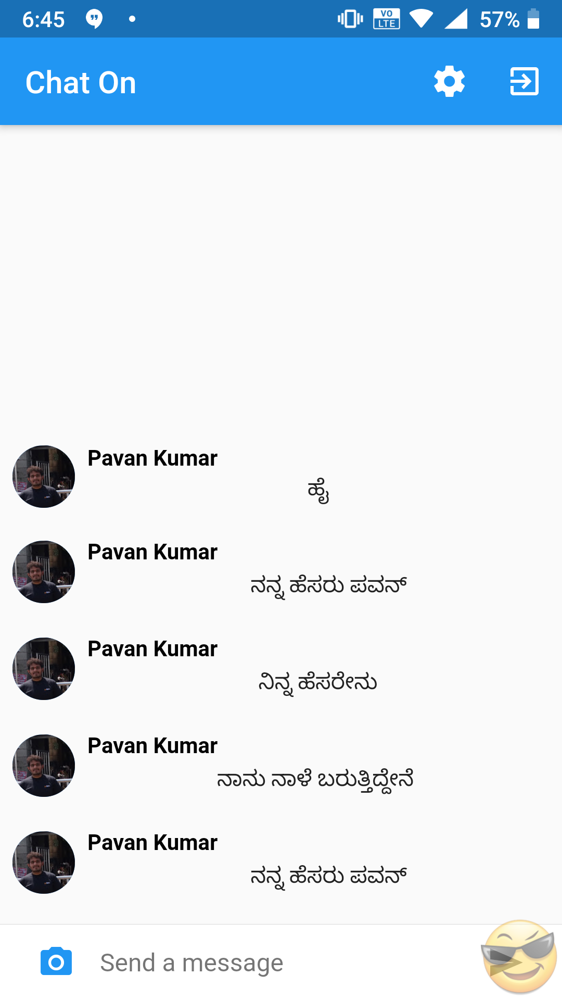
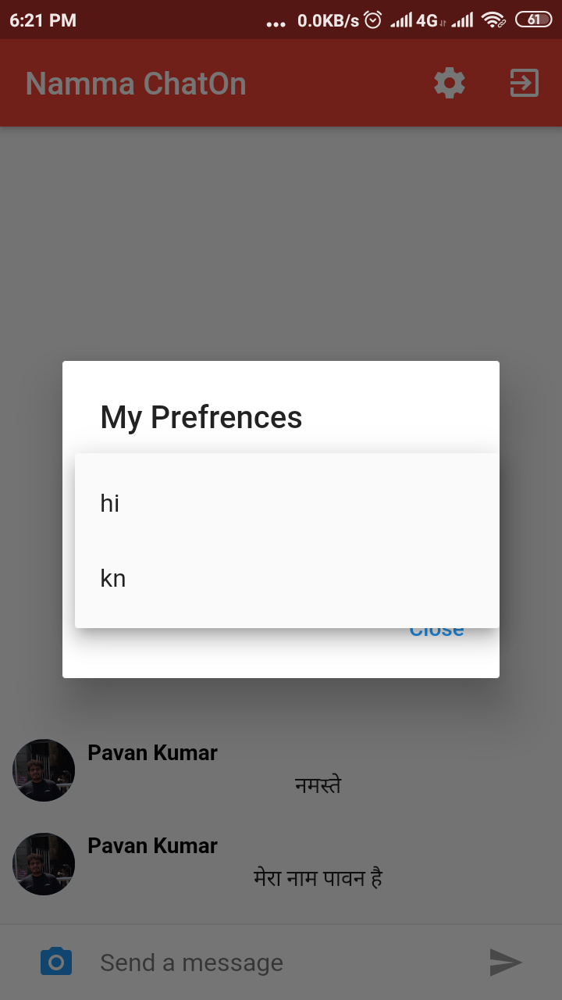
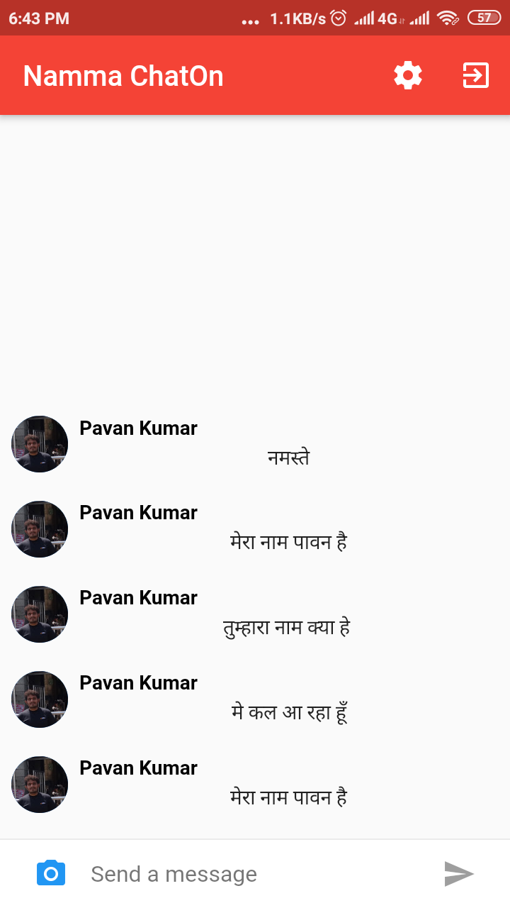

## Namma ChatOn

Namma ChatOn is a simple chat service which has features to translate the incoming messages into user prefered native language in a real time. The basic idea of the app is to eliminate the language barrier between the users communication. The user can wish to communicate with his/her own language while the other can recieve in his/her own language. This app has a wider scope to improvise in supporting multiple source and translation language.

## Screen Shots

## Demo
- [Video](https://t.co/Efzz9LxioP)

## Getting Started

This project is a starting point for a Flutter application.

A few resources to get you started if this is your first Flutter project:

- [Lab: Write your first Flutter app](https://flutter.dev/docs/get-started/codelab)
- [Cookbook: Useful Flutter samples](https://flutter.dev/docs/cookbook)

For help getting started with Flutter, view our 
[online documentation](https://flutter.dev/docs), which offers tutorials, 
samples, guidance on mobile development, and a full API reference.
